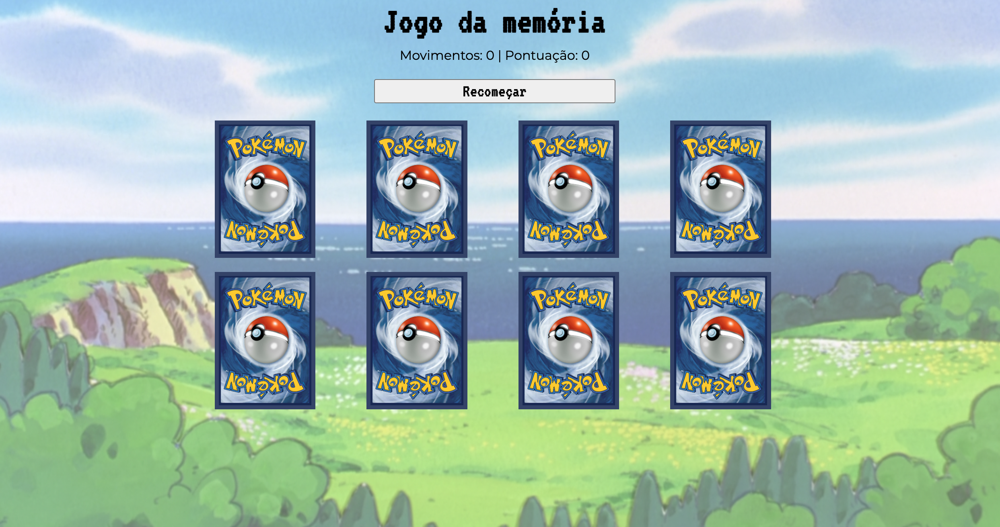
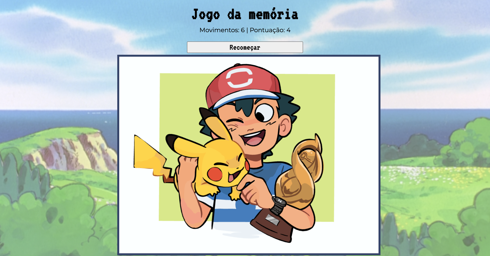

<h1 align="center"> Jogo da memória </h1>

Desenvolvido por Ivan Barbosa. 

<!-- 

Você pode interagir com o deploy do projeto  
<a href="">CLICANDO AQUI!</a>

 -->

  
  
  

 

## 🚀 Tecnologias

Esse projeto foi desenvolvido com as seguintes tecnologias:

- React
- Typescript
- JavaScript
- CSS / Styled Components
- Node.js
- Git e Github

## 💻 Projeto

Um jogo da memória é um desafio mental onde os jogadores revelam cartas emparelhadas, tentando lembrar suas posições. O objetivo é encontrar todos os pares correspondentes, melhorando a memória e a concentração.

## 💻 Clone e acesse o projeto
------------
    `https://github.com/ivanbs14/App_memory.git`

    or 

    `gh repo clone ivanbs14/App_memory`

## 💻 Configurar e executar cliente

Acesse a pasta do cliente:

`cd memorygame/`

Agora, instale e execute seu aplicativo

`npm install`

`npm run dev`

Verifique se o aplicativo front-end esta em execução no local: http://localhost:5173/  (este endereço acima pode variar)

<!-- Se preferir visite o deploy (temporário) do projeto em: https://foofexploreriv.netlify.app/ -->

## 🔖 Dúvidas

'Qualquer dúvida, envie um e-mail para

`ivanbarbosag@gmail.com`

---

## Licença

Esse projeto está sob a licença MIT.

## Aviso de Uso de Imagem com Direitos Autorais para Fins Educativos

`As imagens dos personagens é usada estritamente para propósitos educativos. Reconhecemos os direitos autorais do autor original. Caso o autor deseje a remoção da imagem devido a preocupações de direitos autorais, estamos prontos para agir. Nossa intenção é educacional e respeitosa.`

---
